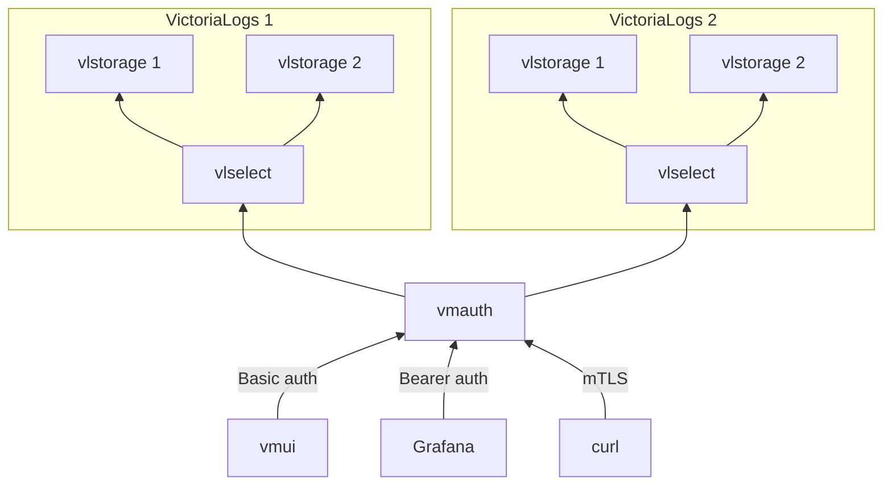
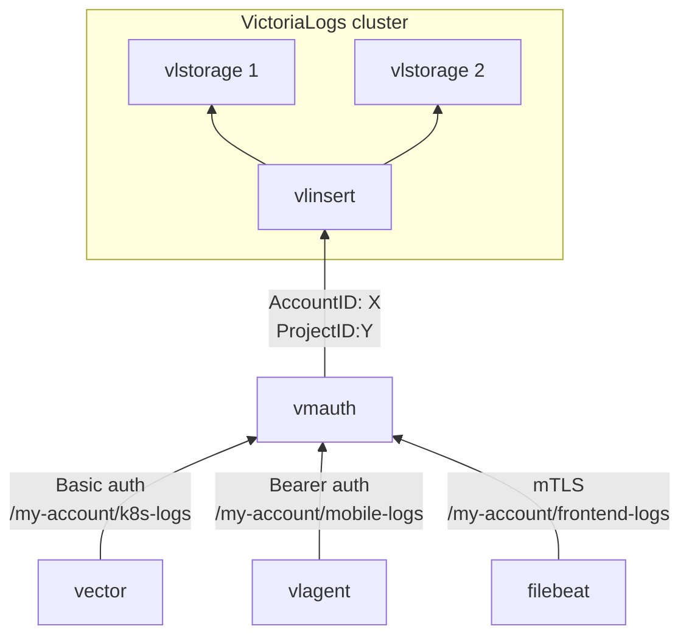

This document describes how to configure and use vmauth and VictoriaLogs components
in the context of load balancing, access protection and log visibility management.

To configure secure communication between components in cluster mode of VictoriaLogs, follow [this documentation](https://docs.victoriametrics.com/victorialogs/cluster/#security).

[vmauth](https://docs.victoriametrics.com/victoriametrics/vmauth/) is an HTTP proxy that provides the following features:
- Load balancing across configured HTTP backends.
- Authentication via Basic Auth, Bearer tokens, or mTLS.
- Access control to specific endpoints or data paths.
- Easy to configure.

vmauth is not specifically aware of VictoriaLogs and does not offer any hidden features
for tighter integration with other VictoriaMetrics components.
Therefore, you can use any other HTTP proxy such as Nginx, Traefik, Envoy or HAProxy.

However, using vmauth makes it easy to configure authorization and receive [community support](https://docs.victoriametrics.com/victoriametrics/single-server-victoriametrics/#community-and-contributions) or [enterprise support](https://victoriametrics.com/support/enterprise-support/).
from the VictoriaMetrics team if any issues arise.

For more detailed information and advanced vmauth configuration see [these docs](https://docs.victoriametrics.com/victoriametrics/vmauth/).

All configuration examples in this documentation apply to
[VictoriaLogs single-node](https://docs.victoriametrics.com/victorialogs/),
[vlselect](https://docs.victoriametrics.com/victorialogs/cluster/),
[vinsert](https://docs.victoriametrics.com/victorialogs/cluster/) and
[vlagent](https://docs.victoriametrics.com/victorialogs/vlagent/)
since they have the same search/write API.

## Search Authorization

For log search, both [VictoriaLogs single-node](https://docs.victoriametrics.com/victorialogs/)
and [vlselect](https://docs.victoriametrics.com/victorialogs/cluster/) expose the same search API endpoints,
which [start with `/select/` prefix](https://docs.victoriametrics.com/victorialogs/querying/#http-api).
When configuring request authorization or load balancing, it is important to allow access to this path prefix.

Below is an example of a vmauth configuration that:
- Uses Basic auth for request authentication.
- Authorizes access to paths starting with `/select/`.
- Distributes requests between two VictoriaLogs instances: `victoria-logs-1` and `victoria-logs-2`.

```yaml
users:
- username: foo
  password: bar
  url_map:
  - src_paths: ["/select/.*"]
    url_prefix:
    - http://victoria-logs-1:9428
    - http://victoria-logs-2:9428
```

`victoria-logs-1` and `victoria-logs-2` can be either two VictoriaLogs single-node instances with replicated data according to [these docs](https://docs.victoriametrics.com/victorialogs/#high-availability),
or `vlselect` instances in [VictoriaLogs cluster](https://docs.victoriametrics.com/victorialogs/cluster/).
Enumerate all the `vlselect` instances in the cluster under the `url_prefix` config above in order to spread load among all the available `vlselect` instances.

The diagram below illustrates this architecture in the clustered version of VictoriaLogs:



Update the connection settings in all clients (like Grafana) after configuring the `vmauth` in order
to match the selected authentication method and the vmauth endpoint.

Important: Requests sent directly to VictoriaLogs bypass vmauth and are not authorized.
To ensure security, it is strongly recommended to restrict network access to VictoriaLogs and prevent direct access from unauthorized clients.

It is recommended to pass the `-insert.disable` command-line flag at `vlselect` for disabling the write API.
This helps protecting against accidental data ingestion via `vlselect` in case of improperly configured log shippers.

For configuration examples using Bearer token, Basic auth, and mTLS see [these docs](http://localhost:1313/victoriametrics/vmauth/#authorization).

### Cluster routing

vmauth allows selecting different clusters depending on the request path. For example:

```yaml
unauthorized_user:
  url_map:
  - src_paths: ["/cold/select/.*"]
    url_prefix: http://victoria-logs-cold:9428
    # drop /cold/ path prefix from the original request before proxying it to url_prefix.
    drop_src_path_prefix_parts: 1

  - src_paths: ["/hot/select/.*"]
    url_prefix: http://victoria-logs-hot:9428
    # drop /hot/ path prefix from the original request before proxying it to url_prefix.
    drop_src_path_prefix_parts: 1
```

The configuration above enables proxying all requests that start with the path prefix `/cold/select/` to the backend at `http://victoria-logs-cold:9428`,
and requests with the path prefix `/hot/select/` to the backend located at `http://victoria-logs-hot:9428`.

This approach is useful when applying different retention policies for various types of logs.
For example, you might store warn-level and higher severity logs in the cold instance / cluster with longer retention,
while keeping debug-level and higher severity logs only in the hot instance / cluster with shorter retention.

The `drop_src_path_prefix_parts` parameter is used to remove the prefix from the path when proxying the request to VictoriaLogs.
For example, if vmauth receives a request to `/cold/select/logsql/query`,
VictoriaLogs will receive the path without the `/cold/` prefix, allowing it to properly handle the search query.

### Tenant-based request proxying

The following `vmauth` config proxies `/select/*` requests with the `AccountID: 0` HTTP header
to the long-term VictoriaLogs instance or cluster, while requests with the `AccountID: 1` HTTP header
are proxied to the short-term VictoriaLogs instance or cluster.

```yaml
unauthorized_user:
  url_map:

  # Proxy requests for the given tenant (AccountID=0) to long-term VictoriaLogs
  # and override the ProjectID with 0.
  - src_paths: ["/select/.*"]
    src_headers:
    - "AccountID: 0"
    url_prefix: "http://victoria-logs-longterm:9428"
    headers:
    - "ProjectID: 0"

  # Proxy requests for the given tenant (AccountID=1) to short-term VictoriaLogs
  # and override the AccountID with 0.
  - src_paths: ["/select/.*"]
    src_headers:
    - "AccountID: 1"
    url_prefix: "http://victoria-logs-shortterm:9428"
    headers:
    - "AccountID: 0"
```

See also [tenant-based data ingestion request proxying](#tenant-based-proxying-of-data-ingestion-requests).

This allows building VictoriaLogs storage system with distinct per-tenant retention configs
similar to [this one](https://github.com/VictoriaMetrics/VictoriaLogs/issues/15#issuecomment-3043557052).

### Proxying requests to the given tenants

To properly separate and access data across tenants, two headers must be set when writing logs: `AccountID` and `ProjectID` according to [these docs](https://docs.victoriametrics.com/victorialogs/#multitenancy).
When querying logs, you must provide the same headers to retrieve the corresponding data.

You can use vmauth to enforce tenant-level access control by automatically setting the required headers after successful authentication.
For example, the vmauth configuration below overrides tenant headers before proxying requests to VictoriaLogs for user `foo` upon successful authentication:

```yaml
users:
- username: foo
  password: bar
  url_map:
  - src_paths: ["/select/.*"]
    url_prefix: "http://victoria-logs:9428"
    headers:
    - "AccountID: 2"
    - "ProjectID: 4"
```

If the user sets the `AccountID` or `ProjectID` headers themselves,
for example through vmui or Grafana data source settings, they will be overridden.

A more practical example, if you have many tenants and want to separate them by name,
vmauth configuration might look like this:

```yaml
users:
- username: foo
  password: bar
  url_map:
  - src_paths: ["/my-account/kubernetes-logs/select/.*"]
    url_prefix: "http://victoria-logs:9428"
    headers:
    - "AccountID: 1"
    - "ProjectID: 5"
    # drop /my-account/kubernetes-logs/ path prefix from the original request before proxying it to url_prefix.
    drop_src_path_prefix_parts: 2

  - src_paths: ["/my-account/mobile-logs/select/.*"]
    url_prefix: "http://victoria-logs:9428"
    headers:
    - "AccountID: 1"
    - "ProjectID: 6"
    # drop /my-account/mobile-logs/ path prefix from the original request before proxying it to url_prefix.
    drop_src_path_prefix_parts: 2

  - src_paths: ["/my-account/frontend-logs/select/.*"]
    url_prefix: "http://victoria-logs:9428"
    headers:
    - "AccountID: 1"
    - "ProjectID: 7"
    # drop /my-account/frontend-logs/ path prefix from the original request before proxying it to url_prefix.
    drop_src_path_prefix_parts: 2

- username: admin
  password: secret
  url_map:
  - src_paths: ["/select/.*"]
    url_prefix: "http://victoria-logs:9428"
```

This configuration allows user `foo` to access 3 different tenants, and user `admin` to access all tenants.
However, user `admin` needs to set the required `AccountID` or `ProjectID` headers by themselves, because vmauth will not set them.

In Grafana, you need to create a separate data source for each tenant and user, an example of such address is: `http://vmauth:8427/mobile-logs`.
Using the configuration above, you do not need to set the tenant in the data source settings because vmauth will set them.
Each tenant will have `vmui` at the address `/select/vmui`, for example: `http://vmauth:8427/mobile-logs/select/vmui`.

If you want to restrict users by only one of the fields `AccountID` or `ProjectID`,
it is enough to not specify the corresponding field in the `headers` section.
For example, the following configuration allows user `my-account-admin` to have access to all `ProjectID`s, but only for one `AccountID`:

```yaml
users:
- username: my-account-admin
  password: foobar
  url_map:
  - src_paths: ["/my-account/select/.*"]
    url_prefix: "http://victoria-logs:9428"
    headers:
    - "AccountID: 1"
    # drop /my-account/ path prefix from the original request before proxying it to url_prefix.
    drop_src_path_prefix_parts: 1
```

To allow unauthenticated access to a specific tenant, define the `unauthorized_user` as shown below:

```yaml
unauthorized_user:
  url_map:
  - src_paths: ["/my-account/frontend-logs/.*"]
    url_prefix: "http://victoria-logs:9428"
    headers:
    - "AccountID: 1"
    - "ProjectID: 7"
    # drop /my-account/frontend-logs/ path prefix from the original request before proxying it to url_prefix.
    drop_src_path_prefix_parts: 2
```

This will grant all users access to logs for the specified tenant without additional authentication.

Note that if you don't specify the `AccountID` or `ProjectID` header,
VictoriaLogs will assume that the corresponding header has a value of 0.

### Access control inside a single tenant

`VictoriaLogs` can apply extra filters per each request to select APIs according to [these docs](https://docs.victoriametrics.com/victorialogs/querying/#extra-filters).
This is useful when you need to give access to a subset of data within a single tenant.
If you want to hide a subset of data within a tenant, use the HTTP query parameter `extra_filters`:

```yaml
users:
- username: foo
  password: bar
  url_map:
  - src_paths: ["/select/.*"]
    url_prefix:
    - http://victoria-logs-1:9428?extra_filters=password:''
    - http://victoria-logs-2:9428?extra_filters=password:''
```

With this configuration, vmauth will add the [empty filter](https://docs.victoriametrics.com/victorialogs/logsql/#empty-value-filter)
`password:''` to each request, which means that the `password` field must be empty or missing in the log.
This is useful in cases when sensitive information has leaked and needs to be hidden.

To restrict log visibility within a specific [log stream](https://docs.victoriametrics.com/victorialogs/keyconcepts/#stream-fields), use the `extra_stream_filters` query parameter.
The configuration below adds an additional [stream filter](https://docs.victoriametrics.com/victorialogs/logsql/#stream-filter)
to each request based on the request path, and routes `/audit-logs` to a separate VictoriaLogs instance:

```yaml
users:
- username: frontend-logs-viewer
  password: secret
  url_map:
  - src_paths: ["/frontend-logs/select/.*"]
    url_prefix: http://victoria-logs:9428?extra_stream_filters=_stream%3A%7Bservice%3Dfrontend-logs%7D
    # drop /frontend-logs/ path prefix from the original request before proxying it to url_prefix.
    drop_src_path_prefix_parts: 1

- username: mobile-logs-viewer
  password: secret
  url_map:
  - src_paths: ["/mobile-logs/select/.*"]
    url_prefix: http://victoria-logs:9428?extra_stream_filters=_stream%3A%7Bservice%3Dmobile-logs%7D
    # drop /mobile-logs/ path prefix from the original request before proxying it to url_prefix.
    drop_src_path_prefix_parts: 1

- username: audit-logs-viewer
  password: secret
  url_map:
  - src_paths: ["/audit-logs/select/.*"]
    url_prefix: http://victoria-logs-audit:9428
    # drop /audit-logs/ path prefix from the original request before proxying it to url_prefix.
    drop_src_path_prefix_parts: 1
```

`extra_filters` and `extra_stream_filters` must be encoded using [percent encoding](https://en.wikipedia.org/wiki/Percent-encoding).
For example, the query `_stream:{service=frontend-logs}` should be written as `_stream%3A%7Bservice%3Dfrontend-logs%7D`.

Prefer using `extra_stream_filters` over `extra_filters` whenever possible.
This can improve search query performance because VictoriaLogs
processes searches using stream filters faster than regular filters. See [LogsQL performance optimization tips](https://docs.victoriametrics.com/victorialogs/logsql/#performance-tips).

## Write Authorization

For log writing, [VictoriaLogs single-node](https://docs.victoriametrics.com/victorialogs/)
and [vlinsert](https://docs.victoriametrics.com/victorialogs/cluster/) expose the same write API endpoints
which [start with `/insert/` prefix](https://docs.victoriametrics.com/victorialogs/data-ingestion/#http-apis),
so when configuring write requests, it is important to set this path for request authorization.

Example vmauth configuration that allows insert requests
with Basic auth authentication and distributes load between `vlinsert` nodes in the cluster:

```yaml
users:
- username: foo
  password: bar
  url_map:
  - src_paths: ["/insert/.*"]
    url_prefix:
    - "http://vlinsert-1:9428"
    - "http://vlinsert-2:9428"
    - "http://vlinsert-3:9428"
```

Note that vmauth cannot replicate data to multiple destinations - it spreads incoming requests among the configured backends.
Use [vlagent](https://docs.victoriametrics.com/victorialogs/vlagent/) for replicating the data to multiple VictoriaLogs instances or multiple VictoriaLogs clusters.

If you trust the writing side, for example when collecting logs within your own cluster, you can set
the [query parameters](https://docs.victoriametrics.com/victorialogs/data-ingestion/#http-query-string-parameters)
and [tenant headers](https://docs.victoriametrics.com/victorialogs/#multitenancy) directly at the log shipper side without an extra proxy.
In such cases, it's usually sufficient to restrict network access so only trusted agents can write to VictoriaLogs.

On the other hand, if you do not trust the writing side, for example, if the logs come from frontend or mobile apps,
it is very important to secure the write API:
- Set up a secure HTTPS connection for vmauth (see [these docs](https://docs.victoriametrics.com/victoriametrics/vmauth/#tls-termination-proxy)) and VictoriaLogs (see [these docs](https://docs.victoriametrics.com/victorialogs/cluster/#security)).
- Protect vmauth with anti-DDoS services if needed.
- Consider the [max_concurrent_requests](https://docs.victoriametrics.com/victoriametrics/vmauth/#concurrency-limiting) parameter to control the number of concurrent write requests.
- Add [monitoring and alerting for vmauth](https://docs.victoriametrics.com/victoriametrics/vmauth/#monitoring) to control the load.
- Write logs from untrusted applications to dedicated VictoriaLogs instances or clusters so that the unpredictable write load does not affect other instances.

It is recommended setting the `-select.disable` command-line flag at `vlinsert` in order to disable search API.
This will secure access to the stored logs in case an attacker has direct network access to `vlinsert`.

For configuration examples using Bearer token, Basic auth, and mTLS see [these docs](http://localhost:1313/victoriametrics/vmauth/#authorization).

### Tenant assignment

vmauth allows redirecting requests to different tenants based on the request path.
Example vmauth configuration that allows insert requests
with Basic auth authentication and distributes load between the configured `vlinsert` nodes for three different [tenants](https://docs.victoriametrics.com/victorialogs/#multitenancy):

```yaml
users:
- username: kubernetes
  password: secret
  url_map:
  - src_paths: ["/my-account/kubernetes-logs/insert/.*"]
    url_prefix:
    - "http://vlinsert-1:9428"
    - "http://vlinsert-2:9428"
    headers:
    - "AccountID: 1"
    - "ProjectID: 5"
    # drop /my-account/kubernetes-logs/ path prefix from the original request before proxying it to url_prefix.
    drop_src_path_prefix_parts: 2
  max_concurrent_requests: 10
- username: mobile
  password: secret
  url_map:
  - src_paths: ["/my-account/mobile-logs/insert/.*"]
    url_prefix:
    - "http://vlinsert-1:9428"
    - "http://vlinsert-2:9428"
    headers:
    - "AccountID: 1"
    - "ProjectID: 6"
    # drop /my-account/mobile-logs/ path prefix from the original request before proxying it to url_prefix.
    drop_src_path_prefix_parts: 2
  max_concurrent_requests: 10
- username: frontend
  password: secret
  url_map:
  - src_paths: ["/my-account/frontend-logs/insert/.*"]
    url_prefix:
    - "http://vlinsert-1:9428"
    - "http://vlinsert-2:9428"
    headers:
    - "AccountID: 1"
    - "ProjectID: 7"
    # drop /my-account/frontend-logs/ path prefix from the original request before proxying it to url_prefix.
    drop_src_path_prefix_parts: 2
  max_concurrent_requests: 10
```

Below is a diagram of this architecture for the clustered version of VictoriaLogs:



### Tenant-based proxying of data ingestion requests

The following `vmauth` config proxies data ingestion requests with the `AccountID: 0` HTTP header
to the long-term VictoriaLogs instance or cluster, while data ingestion requests with the `AccountID: 1` HTTP header
are proxied to the short-term VictoriaLogs instance or cluster:

```yaml
unauthorized_user:
  url_map:

  # Proxy data ingestion requests for the given tenant (AccountID=0) to long-term VictoriaLogs
  # and override the ProjectID with 0.
  - src_paths: ["/insert/.*"]
    src_headers:
    - "AccountID: 0"
    url_prefix: "http://victoria-logs-longterm:9428"
    headers:
    - "ProjectID: 0"

  # Proxy data ingestion requests for the given tenant (AccountID=1) to short-term VictoriaLogs
  # and override the AccountID with 0.
  - src_paths: ["/insert/.*"]
    src_headers:
    - "AccountID: 1"
    url_prefix: "http://victoria-logs-shortterm:9428"
    headers:
    - "AccountID: 0"
```

This allows building VictoriaLogs storage system with distinct per-tenant retention configs
similar to [this one](https://github.com/VictoriaMetrics/VictoriaLogs/issues/15#issuecomment-3043557052).


### Adding extra fields

You can use the `extra_fields` parameter in vmauth to automatically add fields to incoming log entries according to [these docs](https://docs.victoriametrics.com/victorialogs/data-ingestion/#http-parameters).
This is helpful when the writing side cannot include certain metadata, such as the source service name.

The example below adds a `service` field with the value `frontend-logs` to all the logs received at the `/frontend-logs/insert/*` path.
It also includes the `_stream_fields` parameter as an example of how to configure [stream](https://docs.victoriametrics.com/victorialogs/keyconcepts/#stream-fields) for such logs.

```yaml
users:
  bearer_token: foobar
  url_map:
  - src_paths: ["/frontend-logs/insert/.*"]
    url_prefix:
    - "http://vlinsert-1:9428?extra_fields=service=frontend-logs&_stream_fields=service"
    - "http://vlinsert-2:9428?extra_fields=service=frontend-logs&_stream_fields=service"
    - "http://vlinsert-3:9428?extra_fields=service=frontend-logs&_stream_fields=service"
    # drop /frontend-logs/ path prefix from the original request before proxying it to url_prefix.
    drop_src_path_prefix_parts: 1
  max_concurrent_requests: 10
```

Any field sent by the application will be overridden by the value set in the `extra_fields`, if defined.
This protects from unexpected overriding of the provided `extra_fields` by the log shipper.
